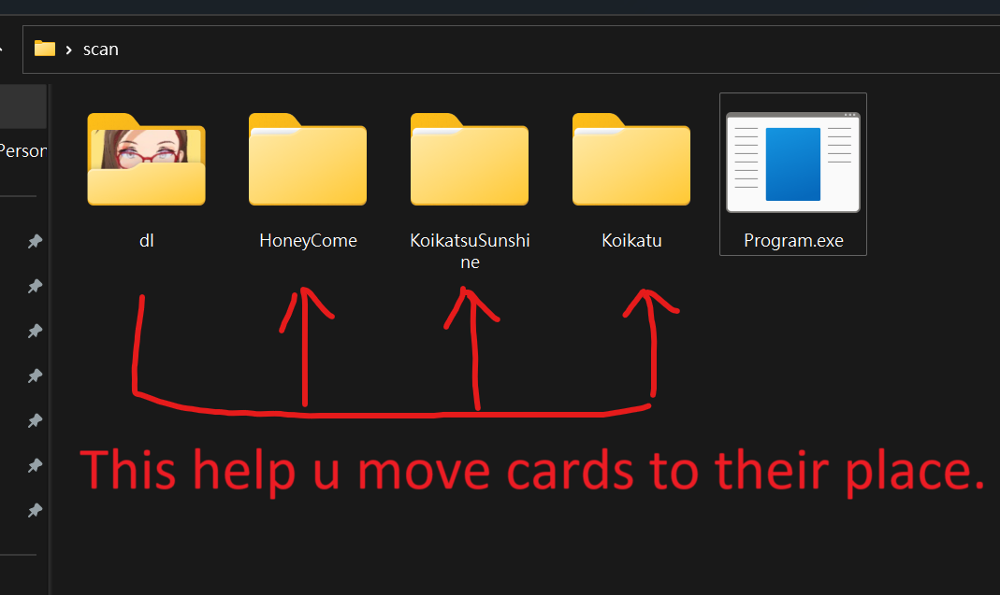

# koikatsu-hamster

## Motivation

If you are as passionate about collecting cards as a man of culture, you might download hundreds of cards in a single day, and you'll need a program capable of categorizing them in bulk. Although KKManager can solve this problem quite well, it relies on a GUI and has a relatively comprehensive set of features (which you might not need all of). This project, on the other hand, focuses solely on categorization.

## Credit

A lot of the code in this project is based on the work done in [KKManager](https://github.com/IllusionMods/KKManager).

## Usage

Place the executable file in your download folder, and run it when you need to organize cards.


## Env

### Install .net SDK

Install [.NET SDK 6.0](https://dotnet.microsoft.com/en-us/download/dotnet/6.0)

### Install deps

```bash
dotnet restore
```

## Build

### Simple build command

```
dotnet build koikatsu-hamster.sln
```

### Build to single exe file

```
dotnet publish koikatsu-hamster.sln -c Release -r win-x64 --self-contained true -p:PublishSingleFile=true -o out
```
